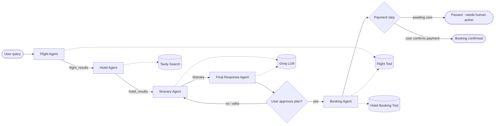

# Tripora

**A LangGraph-orchestrated multi-agent travel planner, served over a FastAPI backend.**

Tripora takes a single natural-language travel request — *"Plan a 5-day trip to Goa under ₹30k"* — and runs it through a graph of specialist agents that fetch flights, research hotels, and assemble a day-by-day itinerary, with full conversation memory across turns.

**Live demo:** [tripora-50av.onrender.com](https://tripora-50av.onrender.com/)

---

## How it works

Tripora isn't a single LLM call wrapped in a chat UI — it's a **stateful agent graph**. Each node owns one job, writes its output into shared state, and hands off to the next node. A PostgreSQL checkpointer persists that state per `thread_id`, so the planner remembers context across follow-up messages.



| Agent | Responsibility |
|---|---|
| **Flight Agent** | Parses the query and pulls flight options via AviationStack |
| **Hotel Agent** | Runs a Tavily web search for hotels matching the destination + query |
| **Itinerary Agent** | Feeds flight + hotel context into the LLM to draft a practical, budget-aware itinerary |
| **Final Response Agent** | Formats everything into a clean, sectioned answer (summary → flights → hotels → day-by-day plan → budget → recommendations) |
| **Booking Agent** | Only runs after explicit user approval of the plan. Reserves the chosen flight and hotel through their respective APIs, but **halts before payment** — the graph interrupts and hands control back to the user for that step, so no charge is ever made autonomously |

State is tracked via a `TypedDict` (`TravelState`) carrying `messages`, `user_query`, `flight_results`, `hotel_results`, `itinerary`, `booking_status`, and an `llm_calls` counter — handy for cost/latency debugging.

### Approval and payment gating

The Booking Agent is intentionally split into two phases so an LLM can never move money on its own:

1. **Reservation phase** — once the user approves the itinerary, the agent holds/reserves flight seats and hotel rooms where the provider supports it (or prepares the exact booking payload if it doesn't).
2. **Payment phase** — the graph hits a hard `interrupt()` here. Execution pauses and the API returns a `pending_payment` status with the booking summary; nothing is charged until the user hits a separate "confirm payment" action, which resumes the graph with their explicit go-ahead.

---

## Tech Stack

- **Orchestration:** LangGraph (`StateGraph`) with a `PostgresSaver` checkpointer for cross-turn memory
- **LLM:** Groq (`qwen/qwen3.6-27b` via `langchain-groq`)
- **Backend:** FastAPI + Jinja2 templates, served with Uvicorn
- **Search/Tools:** Tavily API (hotels/web research), AviationStack API for live flight data (`airportsdata`, `pycountry` for IATA/country normalization)
- **Persistence:** PostgreSQL (thread-level conversation checkpointing)
- **Observability:** LangSmith tracing
- **Deployment:** Docker, hosted on Render

---

## Project Structure

```
Tripora/
├── app.py                 # FastAPI app — routes, request/response models
├── backend.py              # LangGraph graph definition, agents, checkpointer, LLM wiring
├── tools/
│   ├── flight_tool.py      # Flight search tool
│   └── tavily_tool.py      # Tavily-backed hotel/web search
├── templates/               # Jinja2 HTML (chat frontend)
├── static/                  # CSS/JS assets
├── dockerfile
├── requirements.txt
└── test.py
```

---

## Setup

### 1. Clone and install

```bash
git clone https://github.com/akkiyolo/Tripora.git
cd Tripora
pip install -r requirements.txt
```

### 2. Configure environment

Create a `.env` in the project root:

```env
DATABASE_URL=your_postgresql_connection_string      # e.g. Render Postgres
DEFAULT_ORIGIN_IATA=DEL                              # fallback origin airport for flight search
AVIATIONSTACK_API_KEY=your_aviationstack_api_key
GROQ_API_KEY=your_groq_api_key
TAVILY_API_KEY=your_tavily_api_key

# Optional — LangSmith tracing
LANGSMITH_TRACING=true
LANGSMITH_ENDPOINT=your_langsmith_endpoint
LANGSMITH_API_KEY=your_langsmith_api_key
LANGSMITH_PROJECT=Tripora
```

> `DATABASE_URL` powers the LangGraph checkpointer — this is what gives the agent conversation memory (`thread_id`-scoped). `sslmode=require` is auto-appended if missing.

### 3. Run locally

```bash
python app.py
# or
uvicorn app:app --reload
```

App boots on `http://127.0.0.1:8000`.

### 4. Run with Docker

```bash
docker build -t tripora .
docker run -p 8000:8000 --env-file .env tripora
```

---

## API

| Method | Route | Description |
|---|---|---|
| `GET` | `/` | Chat UI (Jinja2) |
| `POST` | `/api/travel` | Runs the agent graph on a message; accepts `{ "message": str, "thread_id": str \| null }` |
| `POST` | `/api/travel/approve` | Confirms the drafted itinerary and triggers the Booking Agent's reservation phase; accepts `{ "thread_id": str }` |
| `POST` | `/api/travel/confirm-payment` | Resumes the interrupted graph and completes the booking after the user explicitly confirms payment; accepts `{ "thread_id": str }` |
| `GET` | `/health` | Liveness check |

**Sample request:**

```bash
curl -X POST http://127.0.0.1:8000/api/travel \
  -H "Content-Type: application/json" \
  -d '{"message": "Plan a 3-day trip from Delhi to Manali on a budget"}'
```

**Sample response shape:**

```json
{
  "success": true,
  "thread_id": "user_xxxxxxxx",
  "answer": "...",
  "flight_results": "...",
  "hotel_results": "...",
  "itinerary": "...",
  "llm_calls": 4
}
```

Pass the same `thread_id` back in a follow-up request to continue planning within the same conversation — the Postgres checkpointer restores prior state automatically.

---

## Roadmap

- [ ] Streaming responses (SSE/WebSocket) instead of blocking `POST /api/travel`
- [ ] Real ticket pricing (current flight tool surfaces availability, not always live fares)
- [ ] Multi-city trip support
- [ ] Booking cancellation / modification flow after payment confirmation

---

## License

MIT — see [LICENSE](./LICENSE).

---

Built by [**Akki**](https://github.com/akkiyolo)
